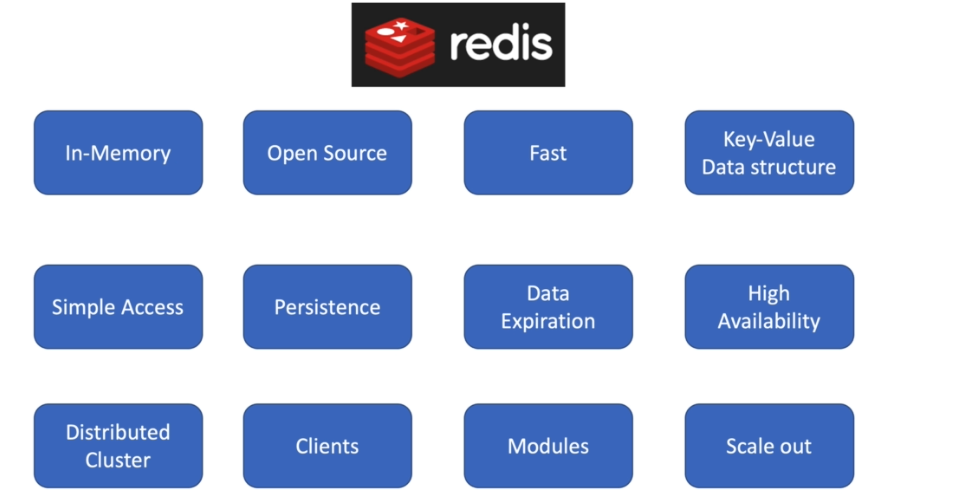
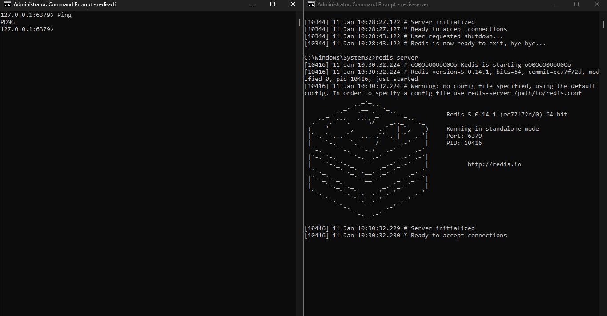

# Redis Tutorial: From Basics to Advanced

## Table of Contents
1. [Introduction to Redis](#1-introduction-to-redis)
2. [Installation and Basic Setup](#2-installation-and-basic-setup)
3. [Redis Data Management](#3-redis-data-management)

---

## 1. Introduction to Redis



### What is Redis?
Redis (**Remote Dictionary Server**) is an open-source, in-memory database with high performance. It is widely used as a **NoSQL database**, cache, message broker, or queue. Redis provides notable features such as:

- High-speed processing
- Flexibility in data management
- Excellent scalability

---

### Key Features of Redis

#### 1. **In-Memory**
- Data is stored entirely in RAM, enabling extremely fast access and processing.
- Supports **Persistence** to ensure data is saved permanently.

#### 2. **Open Source**
- Redis is open-source, free, and supported by a large community.

#### 3. **Fast**
- Redis can perform millions of read/write operations per second, far exceeding traditional storage systems.

#### 4. **Key-Value Data Structure**
- Redis functions as a **Key-Value store**, with support for diverse data types such as:
  - **Strings**
  - **Lists**
  - **Hashes**
  - **Sets**
  - And more...

#### 5. **Simple Access**
- Provides a simple and easy-to-use syntax.
- Offers APIs for multiple programming languages: Python, Node.js, Java, etc.

#### 6. **Persistence**
- Enables data saving from RAM to disk for durability during system restarts or failures.

#### 7. **Data Expiration**
- Supports setting **TTL** (Time-To-Live) for individual keys, ideal for temporary storage or caching.

#### 8. **High Availability**
- Provides **Replication** to ensure high availability and minimize downtime.

#### 9. **Distributed Cluster**
- Supports **Cluster Architecture**, enabling easy scalability by distributing data across multiple nodes.

#### 10. **Client Libraries**
- Offers client libraries for most programming languages, making it easy to integrate with any application.

#### 11. **Modules**
- Extensible with modules like:
  - **RedisJSON**
  - **RedisGraph**
  - **RedisTimeSeries**

#### 12. **Horizontal Scaling**
- Supports scaling out by adding new nodes to the cluster for handling large-scale data.

---

### Common Applications of Redis
1. **Caching**: Temporarily storing frequently accessed data to reduce load on the primary database.
2. **Session Store**: Storing user session data in web applications.
3. **Pub/Sub Messaging**: Acting as a message broker to transmit data between applications.
4. **Leaderboards**: Building real-time leaderboards in gaming or e-commerce.
5. **Stream Processing**: Managing data in a streaming format.

---

## 2. Installation and Basic Setup

### Installation Guide
You can install Redis by referring to online resources such as:
- [Redis Official Documentation](https://redis.io/documentation)
- [Redis GitHub Repository](https://github.com/redis/redis)

### Verify Installation
After installation, start the Redis Server and use the following commands to verify a successful setup:

```bash
redis-server

```
### Picter after succesfull instaltion


## 3: Redis Data Management

Redis is a key-based data structure and falls into the category of databases called "Key-Value stores." Data in Redis is stored and accessed via unique keys, and each piece of data is stored as a key-value pair. 

### Key Features:
- **Key-Value Pairs**: Redis stores data in pairs, where each key is unique and associated with a value.
- **Data Types**: The value associated with a key can be different types, including:
  - **String**
  - **List**
  - **Hash**
  - **Set**
  - And more...

### Important Notes:
- **Exact Key Required**: Data can only be retrieved if you know the exact key used to store it.
- **Flexibility**: Redis offers flexibility in managing data. You can create your own access schema based on the needs of your application.

### Basic Redis Commands:
- `$ set <key> <value>`: Used to store a value associated with a key.
- `$ get <key>`: Used to retrieve the value associated with a key.
- `$ del <key>`: Used to delete a key and its associated value.

### Example:

```bash
# Set a value for a key
$ set user:1000 "John Doe"

# Get the value associated with the key
$ get user:1000
"John Doe"

# Delete the key
$ del user:1000
```
### Define Keys with Expiration

In Redis, you can set keys with an expiration time, meaning that the key will automatically expire and be deleted after a certain period. This can be useful for session management, caching, or time-limited data storage.

#### Setting Keys with Expiration

You can set a key with an expiration time using the following commands:

- `$ set <key> <value> EX <seconds>`: Sets the key with a value and specifies the expiration time in seconds.
- `$ set <key> <value> PX <milliseconds>`: Sets the key with a value and specifies the expiration time in milliseconds.

Alternatively, you can set the expiration of an existing key using the `expire` or `pexpire` commands:

- `$ expire <key> <seconds>`: Sets the expiration time in seconds for an existing key.
- `$ pexpire <key> <milliseconds>`: Sets the expiration time in milliseconds for an existing key.

#### Example:

```bash
# Set a key with an expiration time of 60 seconds
$ set session:12345 "user_data" EX 60

# Set a key with an expiration time of 5000 milliseconds (5 seconds)
$ set session:67890 "user_data" PX 5000

# Set expiration for an existing key (in seconds)
$ expire session:12345 30

# Set expiration for an existing key (in milliseconds)
$ pexpire session:67890 10000

```
### Key Spaces in Redis

Redis provides the concept of key spaces, which act like separate databases or namespaces. This feature allows logical segregation of data, enabling you to use the same key names in different key spaces without conflict. By default, Redis starts with a single key space (index `0`), but you can configure and use multiple key spaces.

---

#### Key Features:

1. **Isolation**:  
   Each key space operates independently, meaning keys in one key space do not affect keys in another.

2. **Same Key Name**:  
   You can use the same key name in different key spaces. For example, `user:100` can exist in both key space `0` and key space `1` with different values.

3. **Key Space Index**:  
   - Redis key spaces are indexed numerically, starting from `0`.  
   - By default, Redis is configured with 16 key spaces (`databases=16` in the configuration file), but this can be adjusted in the Redis configuration.

4. **Management**:  
   You can switch between key spaces, list keys, or clear all keys in a specific key space.

---

#### Redis Configuration for Key Spaces

The number of available key spaces can be defined in the Redis configuration file (`redis.conf`):
```bash
select index
keys specifiacations
flushdb

```

```plaintext
databases 16


